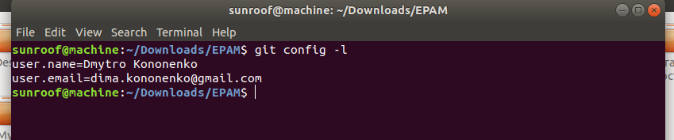
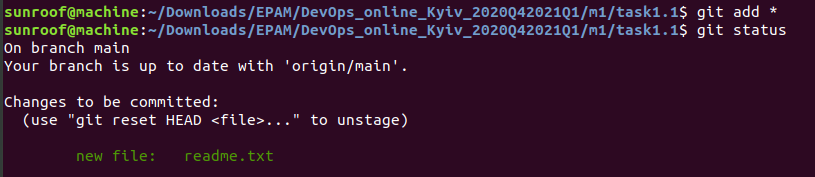
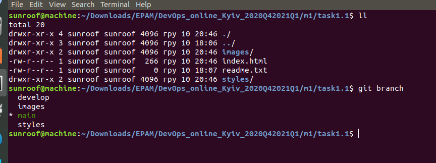
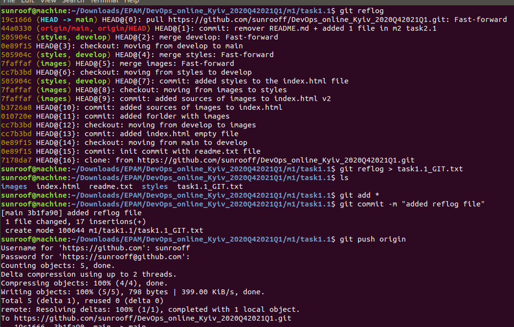

# General review
## task_1.1
**1-2)** GIT is installed; setup of git is done successfully

  
**3-5)** I've already created GitHub account before - so I just crated new repo on it with the structure shown 
**6-10)** Repo was cloned from GitHub to local repository; after that  created readme.txt file and made first init commit.  
   - I used **"http"** route instead of **"ssh"** to make remote connection 
   - to check current connection route I used command **"git remote -v"**) 

  

**11-21)** I've followed all guidelines to make final merge (**develop** -> **main**)  

  

**22-24)** I've inspected logs with using command **"git log -2"** (check last 2 commits). Reflog file was created, saved and pushed to the GitHub repo. 

  

**25** Added **Andrii Kostromytskyi** as collaborator via GitHub (setting of the repository) 

## Summary on what is DevOps for me
In my opinion DevOps is the general model (some kind of a protocol/ideal rules/guidelines) of how software solutions for business should be implemented from the idea of planning, until its release date.
Moreover this model should have the following acpects : 
- flexibility (ability to be edited in any moment of time to be up to date to any changes in the development process/environment)
- process automation (using scripts and development tools DevOps engineer should  make software development process more stable and secure from any kind of mistakes/accidents caused by human factor)
- all acpects of SDLC should work in synergy and really fast (trying to use all available resources as efficiently / productively as possible)
