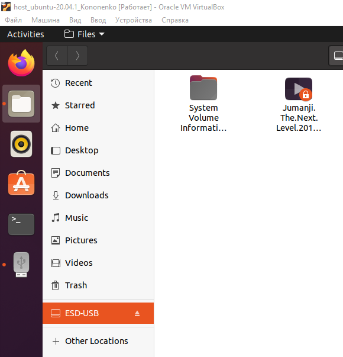

# Module 2 Virtualization and Cloud Basic.
## TASK 2.1
### PART 1. HYPERVISORS

1. **What are the most popular hypervisors for infrastructure virtualization?**
    - _the most popular are Xen (AWS), Oracle VM, vSphere (VMware), Hyper-V (Microsoft) and KVM (Linux, x86 platform)_  
2. **Briefly describe the main differences of the most popular hypervisors.**
    - _there are 2 types of hypervisors:_
      + _Type 1: they work and are installed right on the host's hardware in order to monitor and control guest machines_
         - _Xen (AWS); Oracle VM Server для SPARC_
         - _Oracle VM Server для x86_
         - _Hyper-V     (Microsoft)_
         - _VMware’s ESX/ESXi_
      + _Type 2: run on a regular OS just like other applications on the system. In this case, the guest OS operates as a process on the host,
      while the hypervisors separate the guest OS from the virtual machine operating system_

### PART 2. WORK WITH VIRTUALBOX
#### 1. First run VirtualBox and Virtual Machine (VM).

1.1 - 1.2) I briefly checked the VirtualBox manual; downloaded VirtualBox for Windows and downloaded latest Ubuntu desctop  
 

1.3) Then I installed VirtualBox and Ubuntu 20.04.1 (with the proper name-title as per the guideline)  
  
 

1.4) Tried some possibilities of VM (start, stop, reboot, save state, host key). 
1.5) After that I've created a clone for the main VM.  
 

1.6) Also I've created a group of two VMs  
 

1.7) I tried to make a branched tree but it stood in one line (queue)  
 

1.8) Exported and saved ova file of main VM to the local directory. 
After that ova file imported.  
  
  
  
After the import :
  

#### 2. Configuration of virtual machines
2.1 - 2.2) I explored VM general configuration and managed to configure successfully USB between host and VM1. 

- during configuring of USB - additional plugin should be downloaded/installed into VirtulBox from the main website 

  
  

2.3) Successful configuration of shared folder between host and VM.  
  
  
  
  

2.4) I tested different network modes for VM1, VM2. 

  
Ping each other VM1 and VM2 within lobal Bridge connection type : 
  
Also created a simple table with ping connection review : 
 

#### 3. Work with CLI through VBoxManage. 
3.1 - 3.2) I generally explored CLI with VBoxManage (TBD) 
  
Currently running VM :
 

### PART 3. WORK WITH VAGRANT
TBD

PS.
This time I used Atom as an edit tool.
