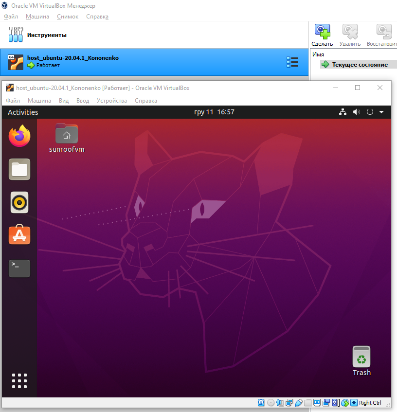

# Module 2 Virtualization and Cloud Basic.
## TASK 2.1
### PART 1. HYPERVISORS

1. **What are the most popular hypervisors for infrastructure virtualization?**
    - _the most popular are Xen (AWS), Oracle VM, vSphere (VMware), Hyper-V (Microsoft) and KVM (Linux, x86 platform)_  
2. **Briefly describe the main differences of the most popular hypervisors.**
    - _there are 2 types of hypervisors:_
      + _Type 1: they work and are installed right on the host's hardware in order to monitor and control guest machines_
         - _Xen (AWS); Oracle VM Server для SPARC_
         - _Oracle VM Server для x86_
         - _Hyper-V     (Microsoft)_
         - _VMware’s ESX/ESXi_
      + _Type 2: run on a regular OS just like other applications on the system. In this case, the guest OS operates as a process on the host,
      while the hypervisors separate the guest OS from the virtual machine operating system_

### PART 2. WORK WITH VIRTUALBOX
#### 1. First run VirtualBox and Virtual Machine (VM).

  

something

  
  

#### 2. Configuration of virtual machines
TBD

### PART 3. WORK WITH VAGRANT
TBD
