# Module 2 Virtualization and Cloud Basic

## TASK 2.2

1. I briefly check guidelines on AWS free tier and it's billing.
2. AWS free tier account is registered.  
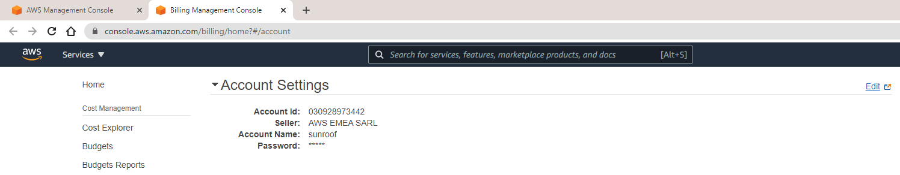 

3. Hands-on tutorials. Accomplished list :  
   - Amazon Lightsail - done ✓
   - Launch and configure a WordPress instance (Lightsail) - done ✓
   - Amazon S3 bucket creation - done ✓
   - Package upload files to Amazon S3 via AWS CLI - done ✓

4. Linux VM via Amazon Lightsail service is launched :  
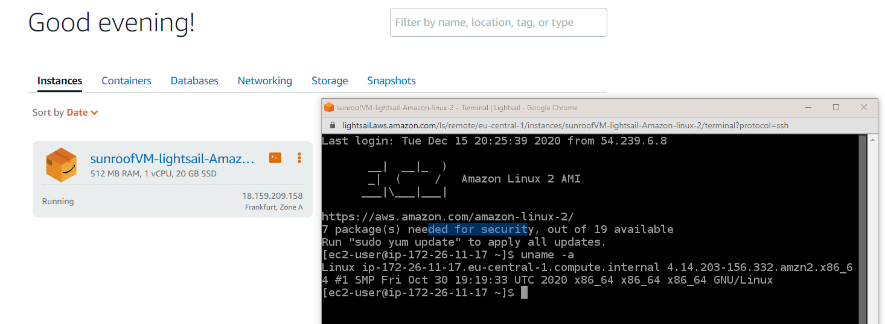 

5. Linux VM via EC2 service (t2 instance, CentOS) is launched :.  
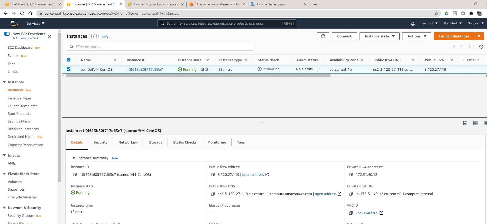  
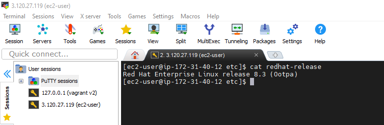 

6. Created snapshot of instance (as a backup). See AMI below :.  
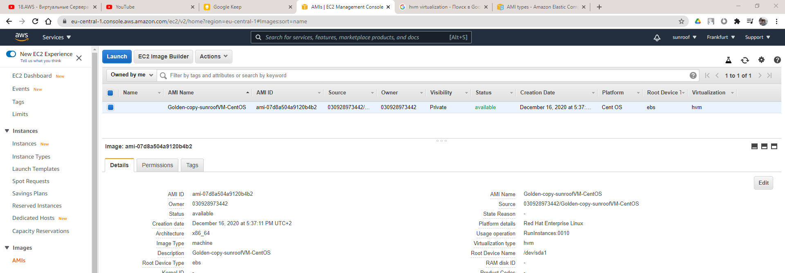  

    - And of course related snapshot of AMI's volume/EBS :
    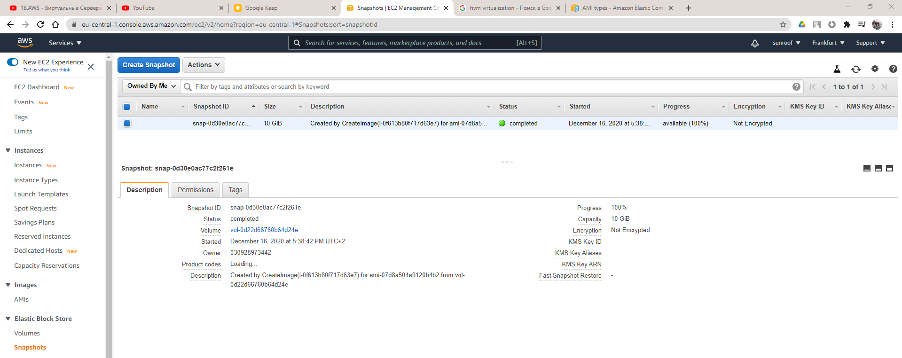  

7. Creation of additional EBS/Volume to the main instance :  
     - EBS/Volume is created :  
     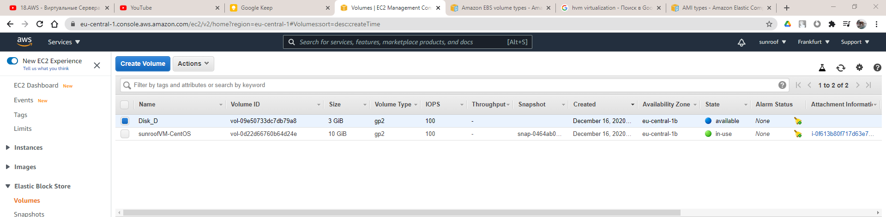  
     - EBS is attached to the main instance :  
     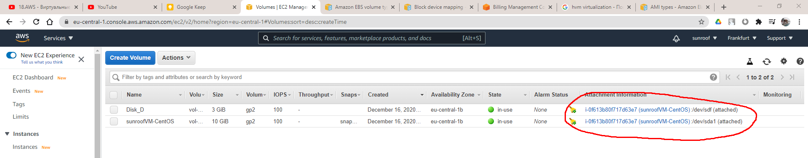  
     - Check_file.txt is stored on new volume :  
     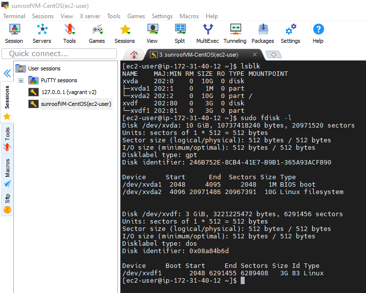  
     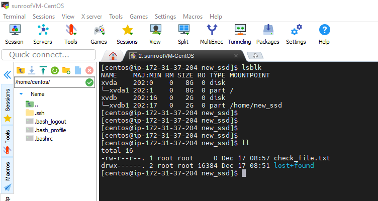  

8-9) Launched instance from AMI and attached to this instance Disk_D :  
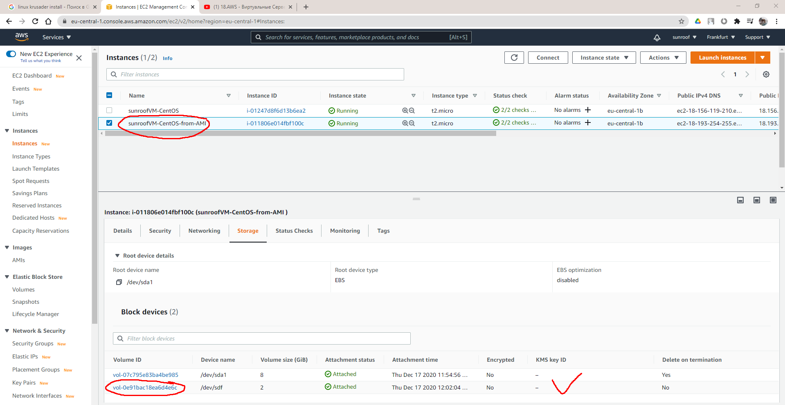  

10. WordPress instance (via Lightsail) is launched and configured :  
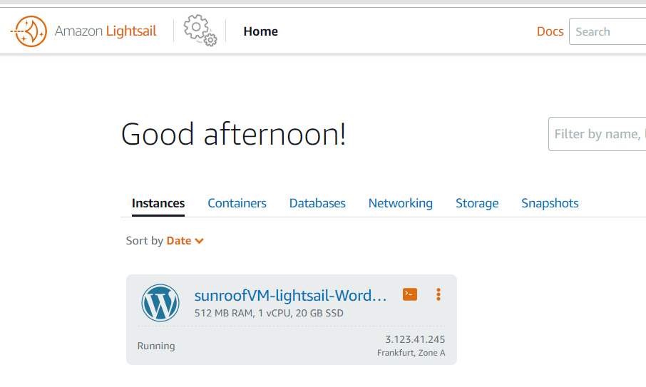  
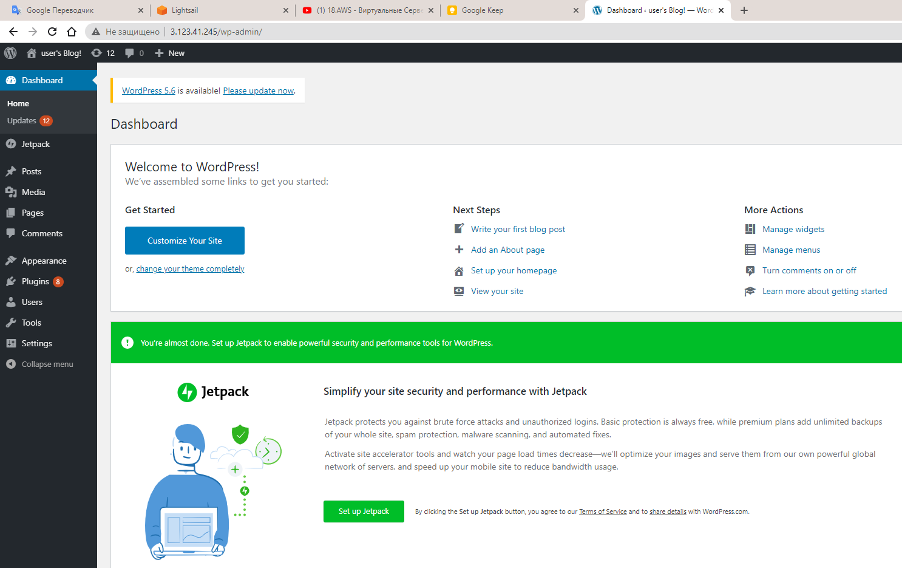  

11. I created bucket in S3 and uploaded/deleted file and folder in it using guideline :  
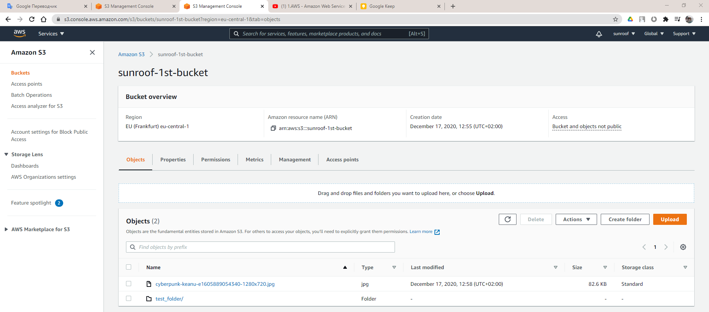  

12. Uploading files to Amazon S3 using the AWS CLI: 
    - IAM user "AWS_admin" is created :  
    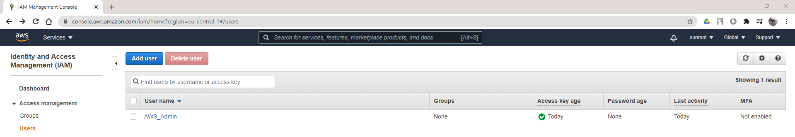  
    - AWS CLI is configured :  
    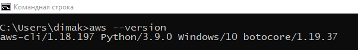  
    - File is uploaded to Amazon S3 via AWS CLI :  
    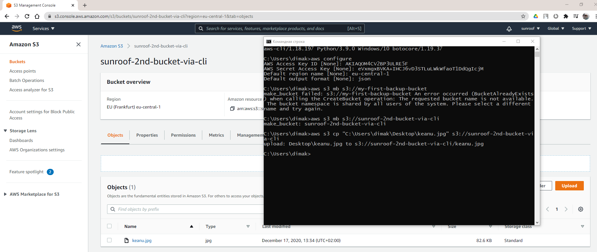  

13. Only explored possibilities of creating my own domain and domain name.
14. Cluster is created Amazon Elastic Container Service (Amazon ECS) :  
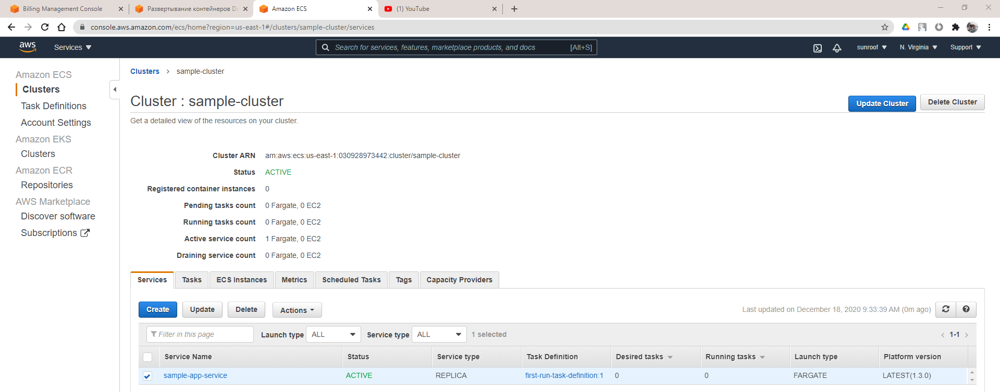  

15. Static website on Amazon S3 : 
http://sunroof-index.s3-website.eu-central-1.amazonaws.com/

 * no domain was registered via Route 53 (I couldn't find free of charge way to do that)
