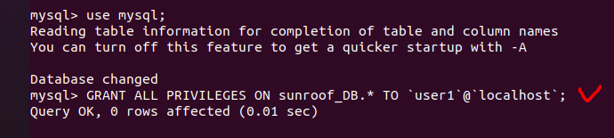
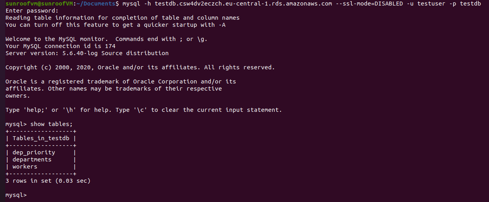

# Module 3 Database Administration.
## TASK 3.1
### PART 1

1. MySQL server veriosn after downloading :  
 

2. **(2-5 tasks)**. MySQL server is installed. Database was created on the server through the console and filled :  
    
   

6. Operators that I used.  
  WHERE : 
    
  GROUP BY : 
    
  OERDER BY : 
    

7. SQL queries that I used :  
   **DDL (data definition language) -> create, alter, drop :** 
     
     
     

   **DML (data manipulation language) -> select, insert, update :** 
     
     
     

   **DCL (data control language) -> grant, revoke :** 
     
    

8. Created new user and connected to the database with all privileges. 
    
    

9. Make a selection from the main table DB MySQL. 
   **TBD**

### PART 2

10. Backup of database is done using the next CL : 
    -*sudo mysqldump sunroof_DB > backup_sunroof_DB.sql*  
     

11. Table and database were deleted using the next CL : 
    - *drop table workers_DB;*
    - *drop database sunroof_DB;*

12. Database is restored using the next CL : 
    - *sudo mysql new_sunroof_DB < backup_sunroof_DB.sql* 

13. Transfer of local database to RDS AWS. 
  
Transfer : 
  

14. Connect to database RDS AWS : 
 
15. Executed SELECT operator WHERE : 
 

16. Dump is created from RDS AWS : 
 

### PART 3  

17. Amazon DynamoDB table is created : 
  

18. Enter data into an Amazon DynamoDB table. 
  

19. Amazon DynamoDB table is filtered using query and scan. 
  **Scan :** 
    
  **Query :** 
   
