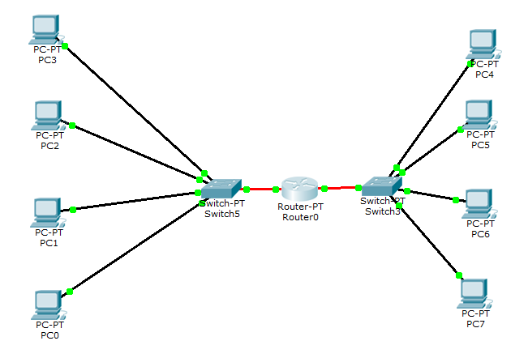

# Module 4 Networking Fundamentals

## Task 4.1

**1-2.** Hub is connected to 4 PCs via Copper Straight-through (прямой кабель, витая пара) : 
  
**3-4.** "ADD SIMPLE PDU" test was successful : 
  
**5.** Simulation via Auto Capture / Play: 
  
**6.** Simulation panel check : 
  
**7.** OSI model package is checked by sent PDU : 
  
**8.** If there are no IPs identified to PCs - the next message will appear : 
  
**9-11** The requested scheme is constructed (6 PCs, 1 Server, 2 Hubs) and checked via simple PDU: 
  
**12-17** The requested scheme (8 PCs, 2 switches) is constructed and checked via simple PDU:  
  

**18-19.** The requested scheme (8 PCs, 2 switches, 1 router) is constructed : 
  

**20.** Both ports of the router is "On" and 2 IPs are assigned according to each subnet : 
  
  

**21.** Default gateway is set for each PC (РС0 - РС7) in lan. 
 - for 1st subnet : 
 

- for 2nd subnet : 
  

**22.** The requested scheme (8 PC, 2 switches, 1 router) is constructed 
  - Checked via simple PDU is successful : 
  
  - Ping from PC1 -> PC7 - not successful : 
    

**23.** I didn't check but as I know - router can make not only IP routing (as switches also can make that) but also NAT, VPN and firewalls. By using router it is possible to get access to internet or upper levels routing (switches cannot do that).
