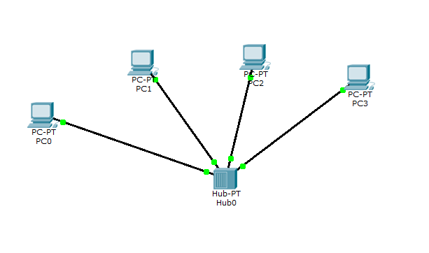

# Module 4 Networking Fundamentals

## Task 4.1

**1-2.** Hub is connected to 4 PCs via Copper Straight-through (прямой кабель, витая пара) : 
  
**3-4.** "ADD SIMPLE PDU" test was successful : 
  
**5.** Simulation via Auto Capture / Play: 
  
**6.** Simulation panel check : 
  
**7.** OSI model package check of sent PDU : 
  
**8.** If there are no IPs in PCs -the next message reveal : 
  
**9-11** The requested scheme is constructed (PC0-PC5, Server, 2 Hubs) : 
  
