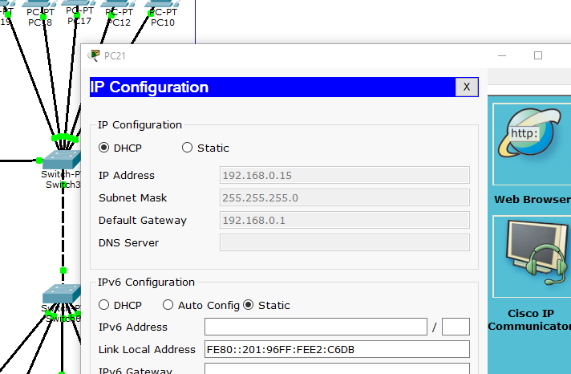
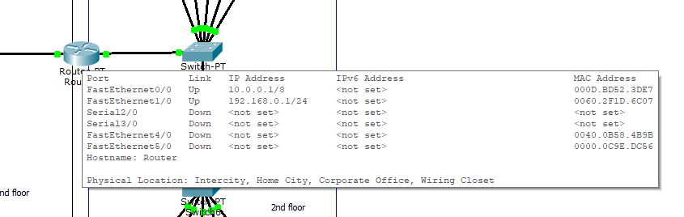
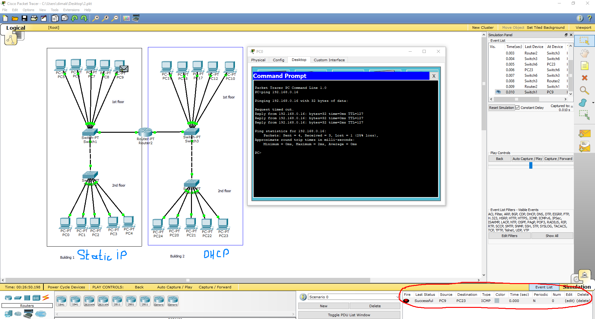
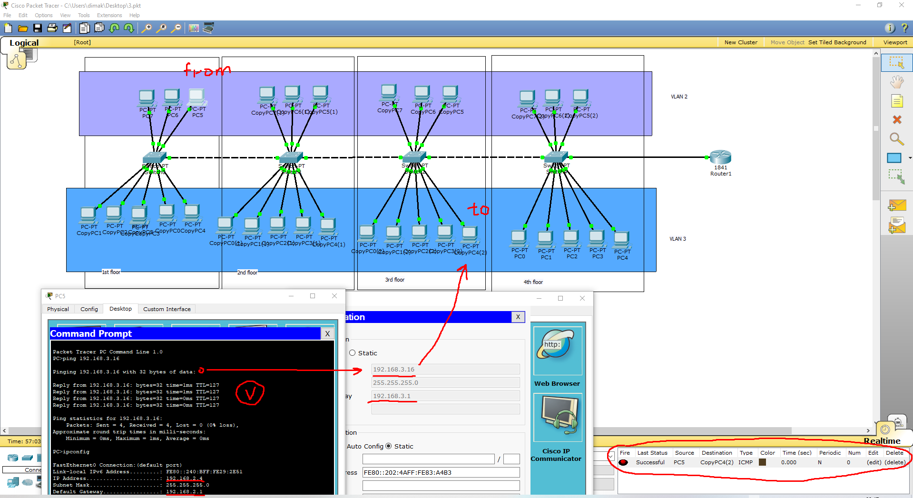
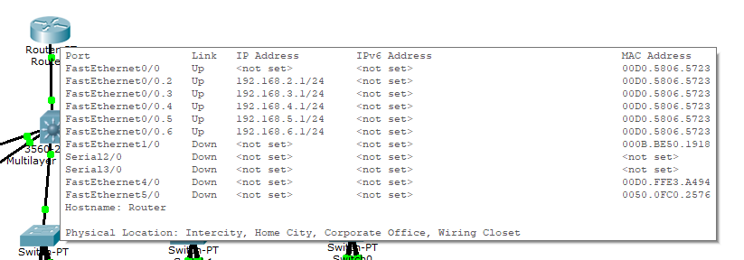
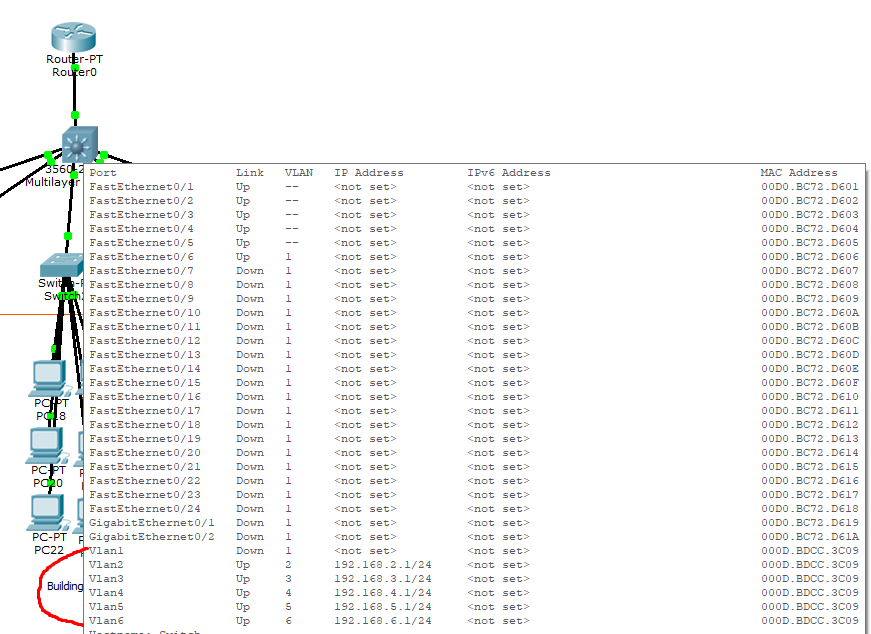
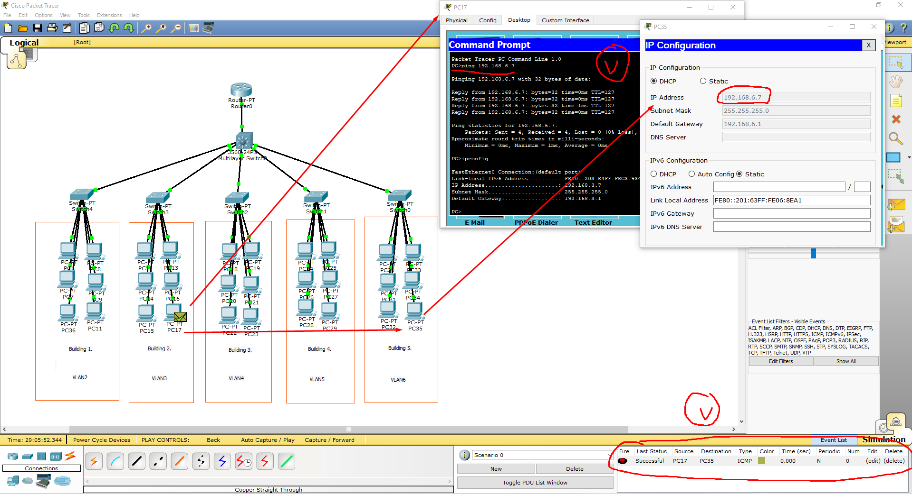

# Module 4 Networking Fundamentals

## Task 4.2  

1. Local net scheme 2 buildings with 2 floors (each floor 5 PCs):  
  - for the 1st building I assigned for PCs static IPs accordingly and for the 2nd building I used DHCP method to assign IPs :
    
  - router's connections:
    
  - ping and PDU are successful: 
    

2. Requested local net is set up (4 floors and for each floor 2 VLANs are needed):  
  - each floor has 1 switch with 2 VLANs included (3 PCs for VLAN2 and 5 PCs for VLAN3);
  - all switches are connected via trunk port;
  - ping and PDU are successful:  
    

3. Requested local net is set up: 
 - router's port is divided into 6 sub ports for each VLAN accordingly:
   

 - each building has its own VLAN:
   

 - ping and PDU are successful. 
   
