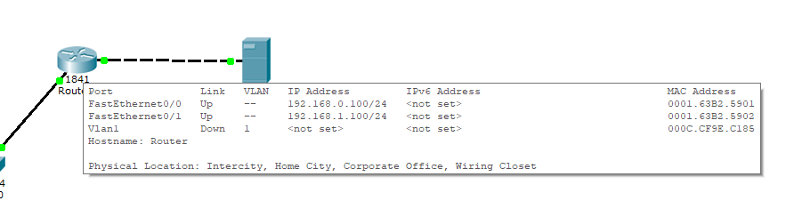

# Module 4 Module - Networking Fundamentals

## Task 4.3

Local net is set with the next scheme (5 PCs, 1 router, 2 servers). 
 - Router settings : 
     

 - Router RIP is set up (version 2) : 
     
