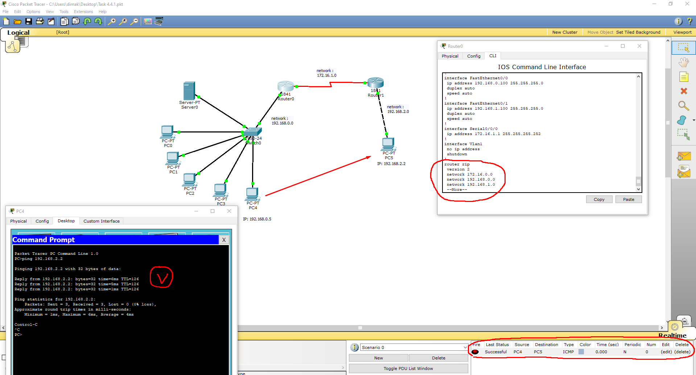
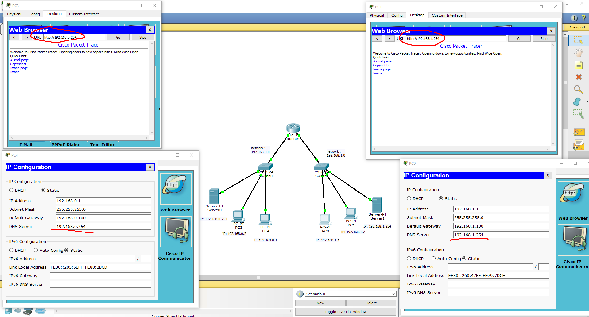

# Module 4 Module - Networking Fundamentals

## Task 4.4

1. Requested net is set up with 2 routers.  
  - Connection is done by using RIP between 2 routers to connect 2 nets; 
  - Ping and ICMP PDU are successful  
     

2. Local net is set with the next scheme (5 PCs, 1 router, 2 servers). 
     
