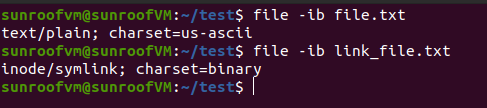
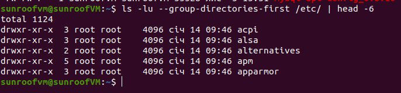

# Module 5 Linux essentials

### Task1.Part1

1) Log in to the system as root. 
via "sudo -i" or 'sudo su' 
 

2) Use the passwd command to change the password. Examine the basic
parameters of the command.
 

&nbsp;&nbsp;&nbsp;&nbsp;&nbsp;&nbsp;what system file does it change? 
&nbsp;&nbsp;&nbsp;&nbsp;&nbsp;&nbsp;**'/etc/shadow'** - password is changed and stored here in a hashed/encrypted view. 

3) Determine the users registered in the system, as well as what commands they
execute.  What additional information can be gleaned from the command
execution?

&nbsp;&nbsp;&nbsp;Using command **'cat /etc/passwd'** I listed all users in the system. Here we can find:

1) username  
2) password  
3) user ID (UID)  
4) group ID (GIP)  
5) personal information (it is empty by now)  
6) and which shell does that user use   
 

4) Change personal information about yourself.  
I used option **'-o'** to change my GECOS information 
**sudo chfn -o 'Dmytro Kononenko' sunroofvm**
 

5) Become familiar with the Linux help system and the man and info commands.
Get help on the previously discussed commands, define and describe any two
keys for these commands. Give examples.

Example 1. Command cat with 2 options -n (number the lines) and -T (show TAB as ^)
 

Example 2. Command chfn with 2 options -u (to check all options) and -w (to change work phone number)
 

6) Explore the more and less commands using the help system. View the contents
of files .bash* using commands.
 

7) Describe in plans that you are working on laboratory work 1. Tip: You should
read the documentation for the finger command.

- I just created requested file via command **'nano .plan'** in home directory.
 

8) List the contents of the home directory using the ls command, define its files
and directories. Hint: Use the help system to familiarize yourself with the ls
command.
 

### Task1.Part2

1) Examine the tree command. Master the technique of applying a template, for
example, display all files that contain a character c, or files that contain a
specific sequence of characters. 
 

- List subdirectories of the root directory up to and including the second nesting level.
 

2) What command can be used to determine the type of file (for example, text or
binary)? Give an example.  
Using command **"file"** with the next option **"-i"** 
  

3) Master the skills of navigating the file system using relative and absolute paths.
How can you go back to your home directory from anywhere in the filesystem? 

We can make it in 3 ways listed below : 
**"cd"** 
**"cd ~"** 
**"cd /home/username/""**

4) Become familiar with the various options for the ls command. Give examples
of listing directories using different keys. Explain the information displayed on
the terminal using the -l and -a switches. 

Option **-l** give additional insight information about folder content : 
- type of file 
- permissions 
- number of symbolic links on that file/folder 
- owner 
- owner group 
- size 
- time of creating 

Option **-a** shows hidden files in the target folder which start on "**.**"  
  

5) Perform the following sequence of operations: 
- create a subdirectory in the home directory; **done**
- in this subdirectory create a file containing information about directories
located in the root directory (using I/O redirection operations); **done**
- view the created file; 
  

- copy the created file to your home directory using relative and absolute
addressing.  
absolute addressing copy :
  
relative addressing copy :
  
- delete the previously created subdirectory with the file requesting removal; **done**
- delete the file copied to the home directory
  

6) Perform the following sequence of operations:
- create a subdirectory test in the home directory; **done**
- copy the .bash_history file to this directory while changing its name to
labwork2;
  

- create a hard and soft link to the labwork2 file in the test subdirectory;
  

- how to define soft and hard link, what do these concepts; 

  **Answer:** Hard link & file itself (which is also a link) have the same inode (place in memory) and point to it. 
  And soft link is only points (link) on the the link of the file (concept link on link).

- change the data by opening a symbolic link. What changes will happen and why 

  **Answer:**
  After I added 1 line on top on the file - the same changes were done in both files :
  (1) main file and (2) hard linked file
  Reason why it happened - when I changed symbolic link it redirected me to the main link first and then changed data in inode itself. That influenced on data in 'hard_lnk_labwork2' file in accordance.

- rename the hard link file to hard_lnk_labwork2;
- rename the soft link file to symb_lnk_labwork2 file;
  

- then delete the labwork2. What changes have occurred and why?  
  **Answer:**
  After deleting the main file - symbolic link corrupted and became empty (don't point to any folder/file) cause it's path to inode was broken via deleting the main file (link). Vice versa the hard link continued to work cause it still points on the inode where the main data stored.

7) Using the locate utility, find all files that contain the squid and traceroute
sequence.  
Command **locate -A traceroute squid** - shows nothing because there are no files with the name "squid". Only "traceroute"

8) Determine which partitions are mounted in the system, as well as the types of
these partitions.
  

9) Count the number of lines containing a given sequence of characters in a given
file.
  

10) Using the find command, find all files in the /etc directory containing the
host character sequence.  
No results for /etc/ directory.  Only starting from root directory there are some files. 
  

11) List all objects in /etc that contain the ss character sequence. How can I
duplicate a similar command using a bunch of grep? 

- using ls: 
  

- using find: 
  

- Using grep: 
  

12) Organize a screen-by-screen print of the contents of the /etc directory. Hint:
You must use stream redirection operations. 

&nbsp;&nbsp;&nbsp;&nbsp;&nbsp;&nbsp;ls /etc/ | less 
&nbsp;&nbsp;&nbsp;&nbsp;&nbsp;&nbsp;ls /etc/ | more

13) What are the types of devices and how to determine the type of device? Give
examples. 

- If we talk about hard disk and it's partitions: 
 

- Video card : 
 

- USB: 
 

- Audio device: 
  

14) How to determine the type of file in the system, what types of files are there?

+ To determine what type of file: **'ls -l'** or **'file'** command can be used:
  - regular files (-)
  - sockets (s)
  - pipes (p)
  - symbolic devices (c)
  - block devices (b)
  - symbolic links (l)
  - directories (d)

15) List the first 5 directory files that were recently accessed in the /etc
directory.
  
