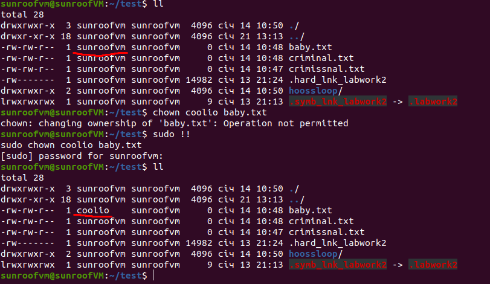

# Module 5 Linux essentials

### Task2.

1. Analyze the structure of the /etc/passwd and /etc/group file, what fields are
present in it, what users exist on the system? Specify several pseudo-users, how
to define them?

- structure of **/etc/passwd** : 
1) username  
2) password (encrypted form is stored in /etc/shadow file)  
3) user ID (UID)  
4) group ID (GID)  
5) GECOS (personal information / user description) 
6) user's home directory 
7) and which shell does that user use  

- structure of **/etc/shadow** : 
1) group name  
2) encrypted password of that group  
3) group ID (GIP)  
4) list of users that belong to this group  
Pseudo-users are to show  processes' ownership. Some pseudo-users : 
a) daemon - used by system service processes 
b) bin - gives ownership of executables command 
c) adm - owns registration files 
d) nobody - used by many services 
e) sshd - used by the secure shell server 
f) myscq - owns all resources concerning databases  
Usually UIDs less than 10 are defined as system accounts. 
10 - 100 UIDs -> pseudo-users concerning to particular components of software

2. What are the uid ranges? What is UID? How to define it?  
'UID' is numeric designation (ID) for an individual user (total number is not more than 65 535). 
These IDs are reserved for special use. UID can be found out in /etc/passwd file or by executing command **"id"** of a current or any other user. Also using environment variable **"echo $UID"** UID can be shown.  
When you need to define only just number of id of a user (without name) -> use command **"id -u username"**
  
Here are the ranges of UIDs:
- 0 -> root
- 1-999 -> daemons, pseudo-users, system and reserved users
- 1000+ -> regular users

3. What is GID? How to define it?  
GID - unique identifier of the group within the system to which the user belongs. GID can be defined via command **"id -g username"** of a current or any other user.

4. How to determine belonging of user to the specific group?  
It can be done by using next command lines : 
 **"groups username"** 
 **"id -Gn username"**

5. What are the commands for adding a user to the system? What are the basic
parameters required to create a user?

- structure: **"useradd option username"**  
  Basic options : 
 -p  - assign password 
 -g  - GID or name of the group to which the user belongs 
 -G  - write additional groups (separated via coma) 
 -s  - shell for the command interpreter for the given user 
 -e  - set a time till user will be disconnected automatically 
 -o  - allows repeating the same user ID 
 -m  - create user's home directory 

6. How do I change the name (account name) of an existing user?  **"usermod -l new_username old_username"**

7. What is skell_dir? What is its structure?  
This is a default template of files/directories that will be automatically created in a home directory of each newly created user. File location : /etc/skel. This folder can be modified.  
  

8. How to remove a user from the system (including his mailbox)?  
 **"sudo userdel -r user_name"** OR **"sudo userdel -l user_name"** 
 to remove user's home directory and mail spool

9. What commands and keys should be used to lock and unlock a user account?  
 To lock : 
 a) passwd -l user_name 
 b) usermod -L user_name  
 To unlock :  
 a) passwd -u user_name 
 b) usermod -U user_name

10. How to remove a user's password and provide him with a password-free login for subsequent password change?  
To remove password of a user: **"sudo passwd -d username"** 
After that no password is asked during su command to that user.

11. Display the extended format of information about the directory, tell about the information columns displayed on the terminal.
12. What access rights exist and for whom (i. e., describe the main roles)?
Briefly describe the acronym for access rights.  
  
First column structure: **"- rwx rwx rwx"**  
. first item stands for the file type : regular(**-**)/directory(**d**)/block device(**b**)/symbolic link(**s**)/pipe(**p**)/socket(**s**)/character device(**c**) 
 . next 3 items are related to User/owner (**u**) rights 
 . 2nd group of 3 items are related to Group (**g**) rights 
 . 3rd group of 3 items are related to Others (**o**) rights  
 where: 
  . **r** stands for "**read**" 
  . **w** stands for "**write**" 
  . **x** stands for "**execute**"  
  . **2nd column**: number of links to that file within the file system  
  . **3rd column**: owner of the file  
  . **4th column**: group of users that to which that file is related  
  . **5th column**: size of file  
  . **6th column**: date and time of file creation  
  . **7th column**: file name  

13. What is the sequence of defining the relationship between the file and the user?  
When any user sets up the process with file then : 
 . if UID of the file is the same as the UID of the process - means that user is the owner of the file; 
 . if the GID of the file matches the GID of any group the user belongs to - means he is a member of the group to which the file belongs; 
 . if neither the UID no the GID of a file matches with the UID of the process and the list of groups that the user running it belongs to, that user is an outsider.

14. What commands are used to change the owner of a file (directory), as well
as the mode of access to the file? Give examples, demonstrate on the terminal. 
- to assign new user : **"chown new_owner file/directory"**
  
- assign different permissions : **"chmod option file/directory"**
  

15. What is an example of octal representation of access rights? Describe the
umask command.  **"umask"** - is a user mask, this is the default range of permissions that will be assigned to file/directory during it creation. It is defined in 2 files (/etc/.bashrc or /etc/.profile).  
Basic permissions within Linux OSs for: 
. directory : 0777 (rwxrwxrwx) 
. file : 0666 (rw-rw-rw)  
Umask (default): 
. user : 0002 (with such umask default permissions **for directory**: 775; **for file**: 664) 
. root : 0022 (with such umask default permissions **for directory**: 755; **for file**: 644)

16. Give definitions of sticky bits and mechanism of identifier substitution. Give
an example of files and directories with these attributes.  **Sticky-bit** - as per my understanding if this bit is added to the file/directory - it means that other users which operate in this shared folder (in coop) can create/read/execute but cannot delete these files (which are assigned with sticky bits).  
Example of folder with sticky bit within ubuntu : 
  
Example of files with sticky bit within /tmp folder :  
  
Example of locally created files with sticky bit:  
  

17. What file attributes should be present in the command script?  
For the script - file should have:  
 . execute(x) permission for owner, group and others 
 . file extension .sh  
 . inside the script the 1st line should be **#!/bin/bash** in order to boot shell bash
